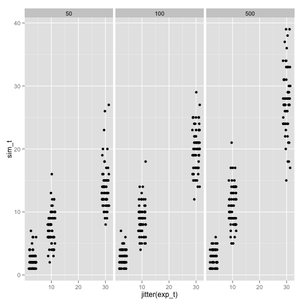
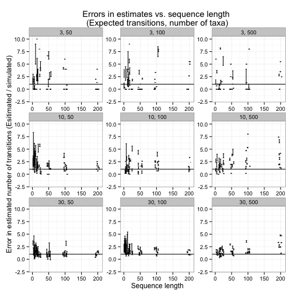

# Ancestral state estimation bias

### October 25 2014


## Instructions to reproduce the simulations and analyses (I suggest you clone this repo and follow the steps below):

  1- Use generate data sets in simulation_data_sets: 

     - Open an R prompt, set the working directory to simulation_data_sets

     - Inspect the file called settings data. This contains the simulation settings

     - In R type the code below. This will generate some folders with xml files for BEAST 2: 

```
source('generate_datasets.R')
```

  
  2 - run BEAST on the the folder for each set of simulations using the bash script run_beast.sh

    - Open run_beast.sh and modify line 7 to as the path to the beast2 binary file in your machine

    - In terminal, cd into each of the simulation settings files (set1, set2, set3, ect..), and execute run_beast.sh. This will run beast for all the xml files in the folder. You would use a command such as this:

```
./run_beast.sh
```


   3 - Simulate ancestral states on the true tree and estimates for the trees in the posterior.

     - In each settings folder, run the script simulate_states.R, using **source('simulate_states.R')**. This script simulates a number of transitions along the true tree, and then estimates the transitions for the trees in the posterior. In the present example it uses the last 100 trees from the posterior, but a larger number should be used in practice. This can be changed in the script accordingly. In this example this will generate three files called: **10res_matrix_20t.txt, 30res_matrix_20t.txt, 3res_matrix_20t.txt**. The first column is the name of the replicate, the second is the true number of simulated transitions, the third and fourth are the maximum and minimum errors in the estimated number of transitions in the trees in the posterior. In this case we define error as: number of transitions in a tree in the posterior - number of simulated transitions.

     4 - In the simulation_data_sets folder run the compile_data.R script using **source('compile_data.R') to obtain a single table with all the results. This will produce a text file called compiled_data.txt with the results for all data sets, which can be used for plotting the results as follows:


Estimated vs. simulated numbers of transitions:


```r
library(ggplot2)

dat_raw <- read.table('compiled_data.txt', head = T, as.is = T)

#dat_raw$error_min <- (dat_raw$min_t - dat_raw$sim_t) / dat_raw$sim_t
#dat_raw$error_max <- (dat_raw$max_t - dat_raw$sim_t) / dat_raw$sim_t

dat_raw$error_min <- dat_raw$min_t / dat_raw$sim_t
dat_raw$error_max <- dat_raw$max_t / dat_raw$sim_t


dat1.1 <- dat_raw
dat1.1$ntax <- factor(dat1.1$ntax)
dat1.1$slen <- factor(dat1.1$slen)

plot1.1 <- ggplot(dat1.1, aes(x = jitter(sim_t), y = ((error_max - error_min) / 2) + error_min)) + geom_errorbar(aes(ymin = min_t , ymax = max_t), width = 0.5) + xlab('Simulated number of transitions') + ylab('Estimated number of transitions') + geom_abline(intercept = 0, slope = 1) + ylim(0, 75) + xlim(0, 30) + facet_wrap(~slen + ntax, ncol = 3) + ggtitle('Estimated vs. simulated number of transitions \n(Sequence length, number of taxa)')

print(plot1.1)
```

 

Estimation error:


```r
dat1.2 <- dat_raw
dat1.2$ntax <- factor(dat1.2$ntax)
dat1.2$slen[dat1.2$slen == 1000] <- dat1.2$slen[dat1.2$slen == 1000] - 800
dat1.2$exp_t <- factor(dat1.2$exp_t)
dat1.2$slen <- jitter(dat1.2$slen, amount = 7)

plot1.2 <- ggplot(dat1.2, aes(x = slen, y =  ((error_max - error_min) / 2) + error_min)) + geom_errorbar(aes(ymin = error_min, ymax = error_max), width = 4) + xlim(0, 205) + facet_wrap(~exp_t + ntax, scales = 'free') + ylim(-2, 20) + ylab('Error in estimated number of transitions (Esitimated - simulated / simulated)') + xlab('Sequence length') + ggtitle('Errors in estimates vs. sequence length \n(Expected transitions, number of taxa)') + theme(axis.ticks = element_blank(), axis.text.x = element_blank())

print(plot1.2)
```

 

