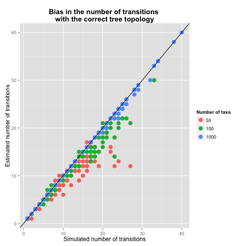

# Bias in the rerootingMethod to estimate the number of transitions

September 2 2014


These simulations show the bias in the rerooting method to estimate the number of transitions on the correct tree and the posterior trees estimated with 500, 100, 50, 20, 10, and 0 nucleotides. 

The number of simulated transitions ranges from 2 to 35. Note that in small trees it is difficult to simulate large numbers of transitions.

## Inherent bias with the correct tree


```r
library(ggplot2)

sim_50 <- read.table('inherent_bias_ntax50.txt', head = T, as.is = T)
sim_100 <- read.table('inherent_bias_ntax100.txt', head = T, as.is = T)
sim_1000 <- read.table('inherent_bias_ntax1000.txt', head = T, as.is = T)


n_taxa <-  factor(c(rep('50', nrow(sim_50)), rep('100', nrow(sim_100)), rep('1000', nrow(sim_1000))))
n_taxa <- relevel(n_taxa, '50')

sim_data <- cbind(rbind(sim_50, sim_100, sim_1000), n_taxa)

plot_A <- ggplot(sim_data, aes(y = est_trans, x = sim_trans, colour = n_taxa)) + geom_point(size = 2) + ylab('Estimated number of transitions') + xlab('Simulated number of transitions') +  scale_colour_discrete(name = 'Number of taxa') + ggtitle('Bias in the number of transitions \nwith the correct tree topology') + theme(plot.title = element_text(face = 'bold')) + geom_abline(intercept = 0, slope = 1)

#pdf('inherent_bias_plot.pdf', useDingbats = T)
print(plot_A)
```

 

```r
#dev.off()
```
