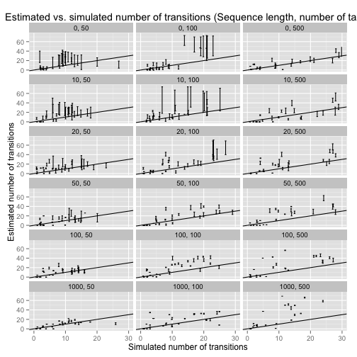
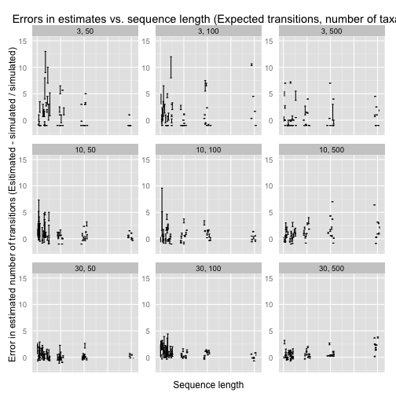

#These are the main trends

25 Sep 2014


Read summary data for all analyses:


```r
library(ggplot2)

dat_raw <- read.table('compiled_data.txt', head = T, as.is = T)

dat_raw$error_min <- (dat_raw$min_t - dat_raw$sim_t) / dat_raw$sim_t
dat_raw$error_max <- (dat_raw$max_t - dat_raw$sim_t) / dat_raw$sim_t
```

# Exploratory graphics


  ## 1.1 Estimated transitions against simulated transitions (panels for expected number of transitions and sequence lenght):


```r
dat1.1 <- dat_raw
dat1.1$ntax <- factor(dat1.1$ntax)
dat1.1$slen <- factor(dat1.1$slen)

#    pdf('estimate_bias_plot.pdf', useDingbats = F, width = 10, height = 12)

plot1.1 <- ggplot(dat1.1, aes(x = jitter(sim_t), y = ((error_max - error_min) / 2) + error_min)) + geom_errorbar(aes(ymin = min_t , ymax = max_t), width = 0.5) + xlab('Simulated number of transitions') + ylab('Estimated number of transitions') + geom_abline(intercept = 0, slope = 1) + ylim(0, 75) + xlim(0, 30) + facet_wrap(~slen + ntax, ncol = 3) + ggtitle('Estimated vs. simulated number of transitions (Sequence length, number of taxa)')

print(plot1.1)
```

```
## Warning: Removed 12 rows containing missing values (geom_path).
## Warning: Removed 1 rows containing missing values (geom_path).
## Warning: Removed 4 rows containing missing values (geom_path).
## Warning: Removed 4 rows containing missing values (geom_path).
## Warning: Removed 4 rows containing missing values (geom_path).
```

 

```r
#dev.off()
```
	
  ## 1.2 Estimation error in the number of transitions against sequence length (panels for sequence length ):
     ### Note that in this case I have subtracted 800 from the longest sequence length (1000) to fit the data in the plots. This means that the x axis is not proportional.


```r
dat1.2 <- dat_raw
dat1.2$ntax <- factor(dat1.2$ntax)
dat1.2$slen[dat1.2$slen == 1000] <- dat1.2$slen[dat1.2$slen == 1000] - 800
dat1.2$exp_t <- factor(dat1.2$exp_t)
dat1.2$slen <- jitter(dat1.2$slen, amount = 7)

#     pdf('error_slen.pdf', useDingbats = F, width = 10, height = 7)
plot1.2 <- ggplot(dat1.2, aes(x = slen, y =  ((error_max - error_min) / 2) + error_min)) + geom_errorbar(aes(ymin = error_min, ymax = error_max), width = 4) + xlim(0, 205) + facet_wrap(~exp_t + ntax, scales = 'free') + ylim(-2, 20) + ylab('Error in estimated number of transitions (Esitimated - simulated / simulated)') + xlab('Sequence length') + ggtitle('Errors in estimates vs. sequence length (Expected transitions, number of taxa)') + theme(axis.ticks = element_blank(), axis.text.x = element_blank())

print(plot1.2)
```

```
## Warning: Removed 2 rows containing missing values (geom_path).
## Warning: Removed 3 rows containing missing values (geom_path).
## Warning: Removed 2 rows containing missing values (geom_path).
## Warning: Removed 4 rows containing missing values (geom_path).
## Warning: Removed 3 rows containing missing values (geom_path).
## Warning: Removed 3 rows containing missing values (geom_path).
## Warning: Removed 3 rows containing missing values (geom_path).
## Warning: Removed 3 rows containing missing values (geom_path).
## Warning: Removed 4 rows containing missing values (geom_path).
```

 

```r
#dev.off()
```
