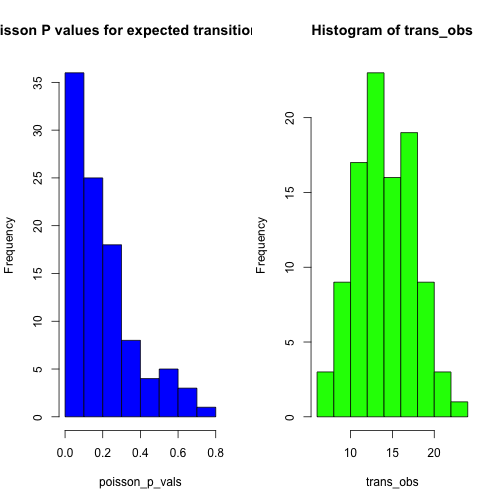
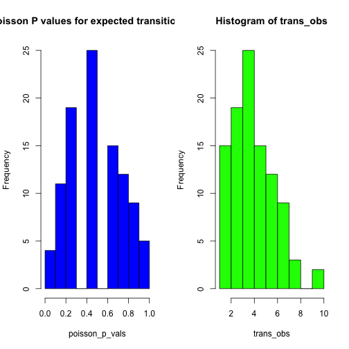

Selecting number of transitions along trees
==========================================

July 18 2014


To do
-----

- ~~Simulate trees under a Yule process with a root height of 1, and 50 tips.~~

- ~~Obtain the Q matrix given a number of expected transitions (*Texp*). This is done using the *get_Q* function, which divides the number of transitions by the total tree length to calculate the rates along Q.~~

- ~~Simulate character data along the tree with Q. The transitions from the simulations are the observed number of transitions (*Tobs*).~~

- ~~Obtain P value of Tobs given a Poisson distribution with lambda = *Texp*.~~

- ~~Repeat the analyses 100 times for 3 values of *Texp*, 20, 10, and 5, and plot the histograms of *P*(just for visual inspection) and of *Tobs*.~~


Load the necessary packages and custom functions:


```r
library(phangorn)
library(phytools)
library(corrplot)
library(TreeSim)
library(NELSI)
source('functions.R')
```

*Texp* = 20 (high)
==================


```r
# Simulate data along trees and get distribution of Pvalues of possion distribution with a high number of transitions
####################################

T_num <- 20
poisson_p_vals <- vector()
trans_obs <- vector()
for(i in 1:100){ 
  tr_sim <- sim.bd.taxa.age(n = 50, numbsim = 1, lambda = 0.5, mu = 0.0, frac = 1, age = 1.00, mrca = FALSE)[[1]]
  tr_sim$edge.length <- tr_sim$edge.length * (1 / max(branching.times(tr_sim)))
  q_high <- get_Q(tr_sim, trans_num = T_num)
  sim_high <- sim.history(tr_sim, anc = 'A', Q = q_high)
  res_temp <- print_diagnostics(sim_high, q_high)
  trans_obs[i] <- res_temp[[2]]
  poisson_p_vals[i] <- res_temp[[1]]
  #if((i %% 10) == 0) print(paste('Running simulation', i, 'of', 1000, 'P=', round(poisson_p_vals[i], 2)))
}

par(mfrow = c(1, 2))
hist(poisson_p_vals, col = 'blue', main = 'Poisson P values for expected transitions = 20')
hist(trans_obs, col = 'green')
```

 

The average observed number of substitutions appears to be  below the observed. The data do not appear to follow a Poisson distribution.


*Texp* = 10 (medium)
====================


```r
# Simulate data along trees and get distribution of Pvalues of Poisson distribution with a medium number of transitions
####################################

T_num <- 10
poisson_p_vals <- vector()
poisson_p_vals <- vector()
for(i in 1:100){ 
  tr_sim <- sim.bd.taxa.age(n = 50, numbsim = 1, lambda = 0.5, mu = 0.0, frac = 1, age = 1.00, mrca = FALSE)[[1]]
  tr_sim$edge.length <- tr_sim$edge.length * (1 / max(branching.times(tr_sim)))
  q_high <- get_Q(tr_sim, trans_num = T_num)
  sim_high <- sim.history(tr_sim, anc = 'A', Q = q_high)
  res_temp <- print_diagnostics(sim_high, q_high)		    
  trans_obs[i] <- res_temp[[2]]
  poisson_p_vals[i] <- res_temp[[1]]
  #if((i %% 10) == 0) print(paste('Running simulation', i, 'of', 1000, 'P=', round(poisson_p_vals[i], 2)))
}

par(mfrow = c(1, 2))
hist(poisson_p_vals, col = 'blue', main = "Poisson P values for expected transitions = 10")
hist(trans_obs, col = 'green')
```

 

A large proportion of the data conform to the poisson process. The centre of mass of the observed transitions is closer to the expected than in the case of *Texp* = 10.

*Texp* = 5 (low)
================


```r
# Simulate data along trees and get distribution of Pvalues of possion distribution with a low number of transitions
####################################

T_num <- 5
poisson_p_vals <- vector()
trans_obs <- vector()
for(i in 1:100){ 
  tr_sim <- sim.bd.taxa.age(n = 50, numbsim = 1, lambda = 0.5, mu = 0.0, frac = 1, age = 1.00, mrca = FALSE)[[1]]
  tr_sim$edge.length <- tr_sim$edge.length * (1 / max(branching.times(tr_sim)))
  q_high <- get_Q(tr_sim, trans_num = T_num)
  sim_high <- sim.history(tr_sim, anc = 'A', Q = q_high)
  res_temp <- print_diagnostics(sim_high, q_high)
  trans_obs[i] <- res_temp[[2]]
  poisson_p_vals[i] <- res_temp[[1]]
  #if((i %% 10) == 0) print(paste('Running simulation', i, 'of', 1000, 'P=', round(poisson_p_vals[i], 2)))
}

par(mfrow = c(1, 2))
hist(poisson_p_vals, col = 'blue', main = "Poisson P values for expected transitions = 5")
hist(trans_obs, col = 'green')
```

 

The centre of mass of the observed transitions is at the expected, or very close. However, it is not clear whether most of the simulations conform to a Possion process.


